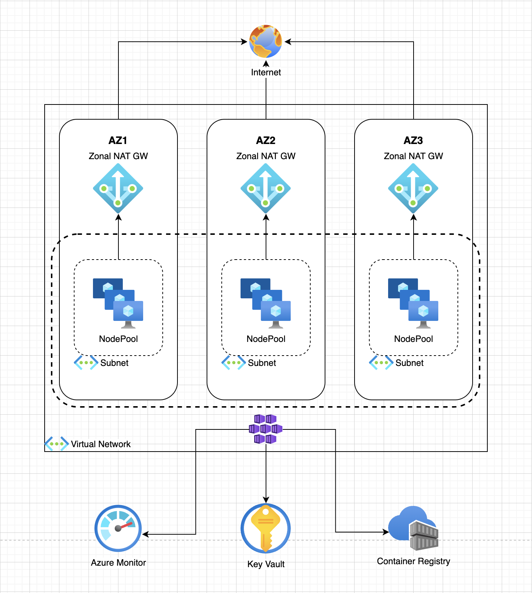

# Azure AKS MultiZone NAT Gateways for Outbound Connectivity

  

The project contains 4 modules.
1. Common - Common infrastructure such as the Resource Group, Container Registry and Key Vault
2. Networking - All the Networking infrastructure including the Virtual Network, Network Security Group and NAT Gateway.
3. Cluster - Creating the Azure Kubernetes Service leveraging the Networking from previous modules.
4. ClusterOperations - The module connects to the Kubernetes cluster through API and apply the required resources for the cluster to properly work with the CSI driver to KeyVault and apply the required Roles and RoleBindings to enable the AKS RBAC.

 
The Following is due to the fact that the inner modules uses it's own providers - in order to keep the freedom to have standalone modules.
 
 

1. terraform init
2. terraform apply -target=module.Common
3. terraform apply -target=module.Networking
4. terraform apply -target=module.Cluster
5. terraform apply -target=module.ClusterOperations

 

Notes:
* There is an issue with Azure AD Group Creation (unless it was resolved) so the creation is being done through shell script as a Workaround
* AKS cluster enable Azure AD for RBAC, in order to connect with kubeclt command it is highy recommanded to use kubelogin, see reference in the following https://azure.github.io/kubelogin/index.html

